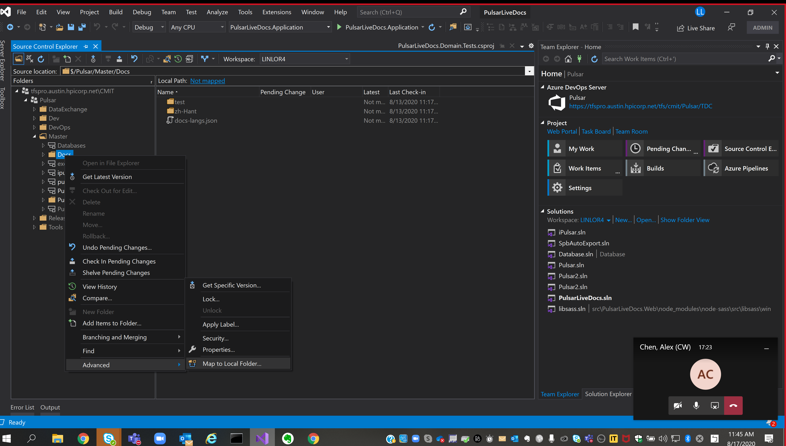

---
uid:{FileE}
name:FileE
---

## Value Objects

 TEstING IMAEG DISPLAYDDDD

[!KeyValue[table_type:B](json/info_definitions.json)]

page in draw.io starts with 0
[!drawio[table_type:0](./5566.drawio)]
