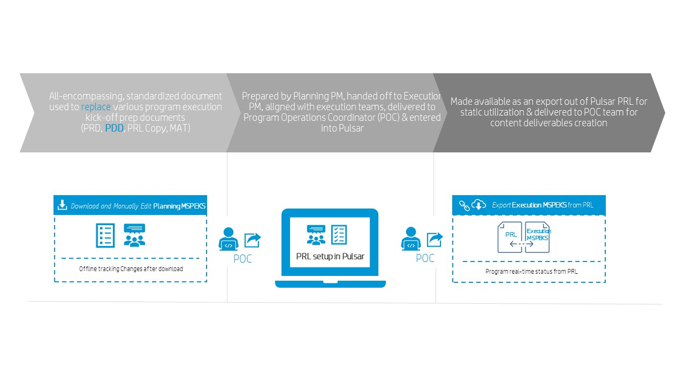

## What is Planning and Execution MSPEKS
MSPEKS stands for Master  Source  of  Program  Execution  Kick-off  Spreadsheet. It is an all-encompassing, standardized document 
used to replace various program execution kick-off prep documents such as PDD, PRL Copy, or MAT. Initially, MSPEKS is prepared by Planning PM, then handed off to Execution PM / execution teams. Next it will be delivered to Pulsar system by POC (Program Operations Coordinator). Please refer to the figure shown below: 

   